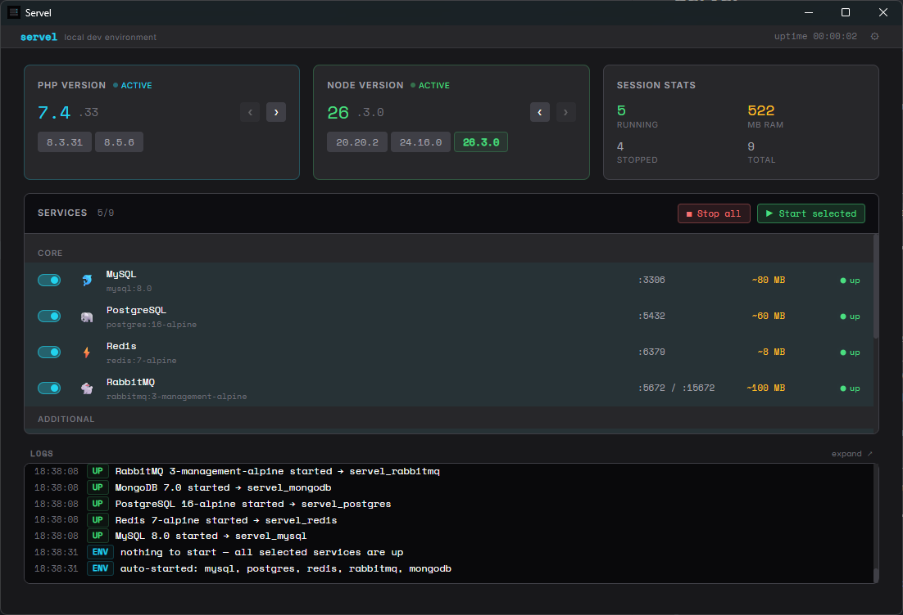
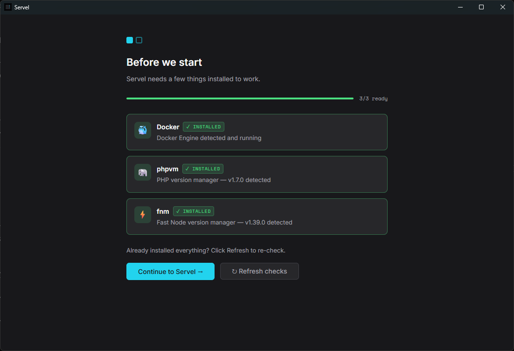
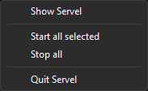
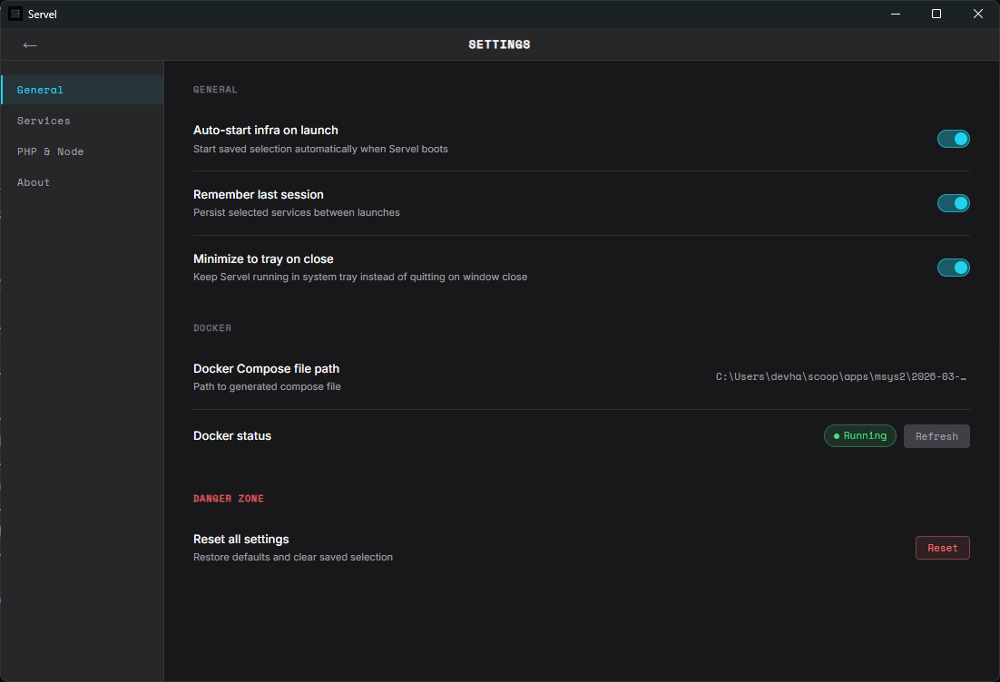
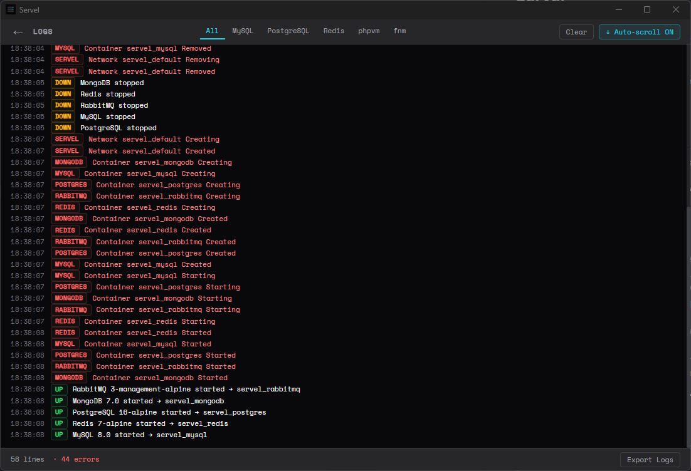

# Servel

> **One app. All your local dev environment.**

Servel is a desktop app (Tauri 2 + Vue 3) that orchestrates your local development environment from a single UI: switch PHP and Node versions, and start/stop Docker-based services — without juggling three terminals every morning.



> Screenshots will be added by the maintainer before the public release. Broken image links above are expected on the current `phase-5-release` branch.

---

## Features

- **PHP version switching** via [phpvm](https://github.com/devhardiyanto/phpvm) — list installed versions, switch active, install new.
- **Node version switching** via [fnm](https://github.com/Schniz/fnm) — same workflow as PHP.
- **Docker services orchestration** — MySQL, PostgreSQL, Redis, RabbitMQ, MongoDB, MinIO, Mailpit, Gotenberg, SQL Server. Toggle what you need, click Start.
- **Auto-detect `.phpvmrc` / `.nvmrc`** — point Servel at a project folder, it picks the right versions.
- **Persistent state + system tray** — Servel remembers your last selection; runs from the tray so it does not crowd your taskbar.
- **Dynamic `docker-compose.yml` generator** — only the services you toggled on are written to the compose file. Saves RAM, keeps the runtime clean.

---

## Install

Download the installer for your OS from the [Releases page](https://github.com/devhardiyanto/servel/releases).

> Servel v1.0 ships **unsigned** for Windows and macOS. Workarounds are documented below; see the FAQ for the long-term plan.

### Windows

1. Download `Servel_1.0.0-beta.1_x64-setup.exe` from Releases.
2. Run the installer.
3. Windows SmartScreen will warn: *"Windows protected your PC"*. Click **More info** → **Run anyway**.
4. Follow the NSIS installer wizard.
5. When prompted about `.wslconfig`, choose:
   - **Yes (Overwrite)** — replace your existing `%USERPROFILE%\.wslconfig` with the Servel-recommended one.
   - **No (Append)** — append Servel's WSL2 settings to the bottom of your existing file.
   - **Cancel (Skip)** — leave `.wslconfig` untouched; you can edit it manually later.
6. Launch Servel from the Start Menu.

After install, restart WSL once so the new `.wslconfig` takes effect:

```powershell
wsl --shutdown
```

### macOS

1. Download `Servel_1.0.0-beta.1_aarch64.dmg` (Apple Silicon) or `Servel_1.0.0-beta.1_x64.dmg` (Intel) from Releases.
2. Open the DMG, drag **Servel.app** into your **Applications** folder.
3. On first launch macOS Gatekeeper blocks the app because it is unsigned. Open Terminal and run:
   ```bash
   xattr -d com.apple.quarantine /Applications/Servel.app
   ```
4. Launch Servel from Applications or Spotlight.

### Linux

1. Download `Servel_1.0.0-beta.1_amd64.AppImage` from Releases.
2. Make it executable and run:
   ```bash
   chmod +x Servel_1.0.0-beta.1_amd64.AppImage
   ./Servel_1.0.0-beta.1_amd64.AppImage
   ```

---

## Prerequisites

Servel orchestrates external tools — it does not install them for you. Make sure these are available on your PATH before first run.

### Docker

- **Windows / macOS:** [Docker Desktop](https://www.docker.com/products/docker-desktop/) — make sure it is running before starting any service from Servel.
- **Linux:** [Docker Engine](https://docs.docker.com/engine/install/) + the Compose v2 plugin. Add your user to the `docker` group so you do not need `sudo`.

### phpvm — PHP version manager

- Repo: [github.com/devhardiyanto/phpvm](https://github.com/devhardiyanto/phpvm)
- Install via the instructions on the repo (PowerShell on Windows, shell installer on Linux/macOS).
- After install, add the `phpvm` hook to your shell profile so version switching takes effect in new terminals:
  ```bash
  phpvm hook
  ```

### fnm — Node version manager

- Repo: [github.com/Schniz/fnm](https://github.com/Schniz/fnm)
- Install via the official installer or your package manager (`winget install Schniz.fnm`, `brew install fnm`, `cargo install fnm`).
- Add the fnm shell hook to your profile as documented in the fnm README.

---

## First Run



On first launch Servel runs an **Onboarding** flow:

1. **Prerequisites check** — Servel detects Docker, phpvm, and fnm. Missing items get a red badge with a link to the install instructions.
2. **Pick your services** — toggle the services you usually use. You can change this later.
3. **Pick versions** — choose your active PHP and Node versions from the lists detected by phpvm and fnm.
4. **Done** — you land on the Dashboard. Click **Start** to bring up your selected services.

---

## Tray Menu



Servel runs from the system tray. Right-click the tray icon for:

- **Show Servel** — open the main window.
- **Start all selected** — bring up every service currently toggled on.
- **Stop all** — bring down every running service.
- **Quit Servel** — exit the app (services keep running unless you stopped them first).

---

## Screens

- 
- 

---

## FAQ & Troubleshooting

### "Port already in use" when starting a service

Another process is bound to the port Servel needs. Find it and stop it:

```powershell
# Windows
netstat -ano | findstr :3306

# macOS / Linux
lsof -i :3306
```

Stop the offending process, or change the service port mapping in Servel Settings.

### "Docker not running" / containers fail to start

Start Docker Desktop (Windows/macOS) or the Docker daemon (Linux: `sudo systemctl start docker`) before clicking Start in Servel.

### `phpvm` hook not installed — PHP version does not change

Make sure your shell profile (`~/.bashrc`, `~/.zshrc`, or PowerShell `$PROFILE`) sources the phpvm hook. Run `phpvm hook` and follow the printed instructions, then restart your shell.

### `.wslconfig` settings not applied (Windows)

WSL only reads `.wslconfig` at startup. After install (or after editing the file), run:

```powershell
wsl --shutdown
```

Then start Docker Desktop again.

### Windows SmartScreen blocks the installer

Servel v1.0 is **unsigned** to keep the project free of certificate costs during beta. SmartScreen will show a warning — click **More info** → **Run anyway**. Code signing is on the roadmap for v1.1 if adoption justifies the cost.

### macOS says "Servel is damaged and can't be opened"

This is Gatekeeper's quarantine attribute on an unsigned app. Remove it:

```bash
xattr -d com.apple.quarantine /Applications/Servel.app
```

Apple notarization is on the roadmap for v1.1.

### Service stays stuck on "starting"

Check the Logs viewer for that service. Common causes: image still pulling on first run, port conflict, or Docker out of disk space (`docker system prune` to reclaim).

---

## Contributing

Bug reports, feature requests, and pull requests are welcome.

- **Issues:** [github.com/devhardiyanto/servel/issues](https://github.com/devhardiyanto/servel/issues)
- **Discussions:** [github.com/devhardiyanto/servel/discussions](https://github.com/devhardiyanto/servel/discussions)

Please include your OS, Servel version, and relevant log output when filing a bug.

---

## Development

```bash
npm install
npm run tauri dev
```

Requirements: Node.js 20 LTS, Rust stable (via [rustup](https://rustup.rs/)), and platform-specific build tools (Visual Studio Build Tools "Desktop development with C++" on Windows; Xcode Command Line Tools on macOS; standard `build-essential` + `libwebkit2gtk-4.1-dev` on Linux).

---

## License

MIT. See [LICENSE](LICENSE) for details.
